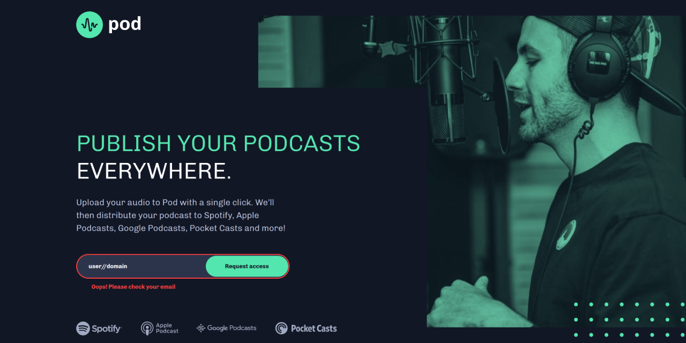

# 🚀 Pod request access landing page




A responsive landing page built as part of a [Frontend Mentor challenge](https://www.frontendmentor.io/challenges/pod-request-access-landing-page-eyTmdkLSG).

The project focuses on writing clean, accessible, and maintainable front-end code using semantic HTML, modern CSS, and vanilla JavaScript.

---

## 🔗 Links

- 🌎 [Live site](https://vimpdev.github.io/fem-js-newbie-05-pod-request-access/)
- 📌 [Frontend Mentor solution](https://www.frontendmentor.io/solutions/pod-request-access-landing-accessible-form-validation-and-css-layers--nE_yLaR5f)

---

## 🎬 Demo


---

## 📸 Screenshots

### 📱 Mobile

| Default | Validation Error | Success |
| --- | --- | --- |
|  |  |  |

### 📲 Tablet

| Default | Validation Error | Success |
| --- | --- | --- |
|  |  |  |

### 🖥️ Desktop

| Default | Validation Error | Success |
| --- | --- | --- |
|  |  |  |

---

## ✨ Features

* Responsive layout for mobile, tablet and desktop
* Semantic HTML5
* Mobile-first
* Accessible form validation
* Animated toast notification
* Keyboard-friendly interactions
* Hover and focus-visible states

---

## 🛠 Tech Stack

* HTML5
* CSS
  * Layers
  * Custom Properties
  * Grid
  * Flexbox
* Vanilla JavaScript (ES6+)
* Constraint Validation API

---

## ♿ Accessibility

This project includes:

* Semantic HTML structure
* Keyboard navigation
* Visible focus indicators
* Dynamic `aria-invalid` and `aria-describedby`
* Live success announcement using `role="status"`

---

## ⚙️ Form Validation

The email field uses the browser's **Constraint Validation API**.

```text
Submit form
      │
      ▼
Is the email valid?
  │                │
  │ No             │ Yes
  ▼                ▼
Display error    Clear error state
Update ARIA      Reset the form
Focus input      Return focus to email field
                 Show success toast
```

---

## 💡 What I Learned

Working on this project helped me practice more than responsive layouts.

Some areas I improved were:

* Organizing styles with CSS Cascade Layers
* Building accessible form validation with the Constraint Validation API
* Updating ARIA attributes dynamically with JavaScript
* Creating a reusable toast component using CSS animations
* Keeping commits focused on complete feature

---

## 🤖 AI Collaboration

ChatGPT was used as a development assistant to discuss implementation ideas, review accessibility decisions, and validate edge cases.

All HTML, CSS, JavaScript, testing, debugging, and implementation decisions were completed manually.

---

## 👩‍💻 Author

- Frontend Mentor – [@vimpdev](https://www.frontendmentor.io/profile/vimpdev)

---